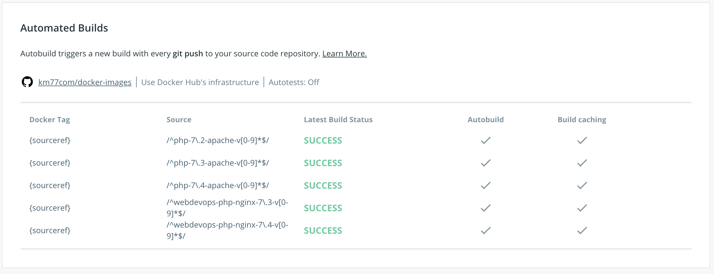
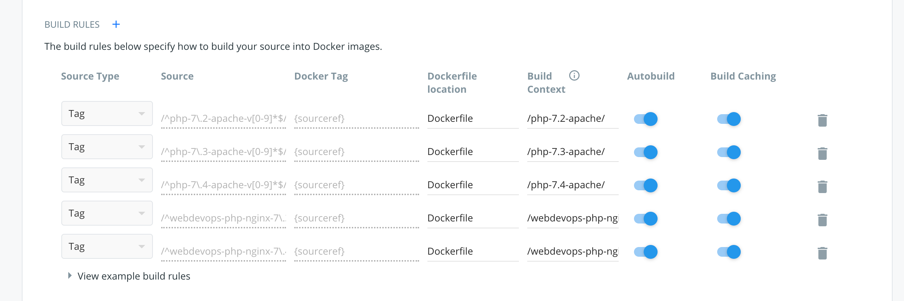

# Docker images
Dockerfile configurations for images published at [https://hub.docker.com/u/km77/](https://hub.docker.com/u/km77/)

To create a new image it is only needed to create a **new** git tag with a name structure that
fit the regex configured in Docker Hub:
[https://hub.docker.com/repository/docker/km77/docker-images/builds](https://hub.docker.com/repository/docker/km77/docker-images/builds)

Example of tag regex: `/^webdevops-php-nginx-7\.4-v[0-9]*$/`

Then push the tags to git repository `git push --tags` and Docker Hub will create the image